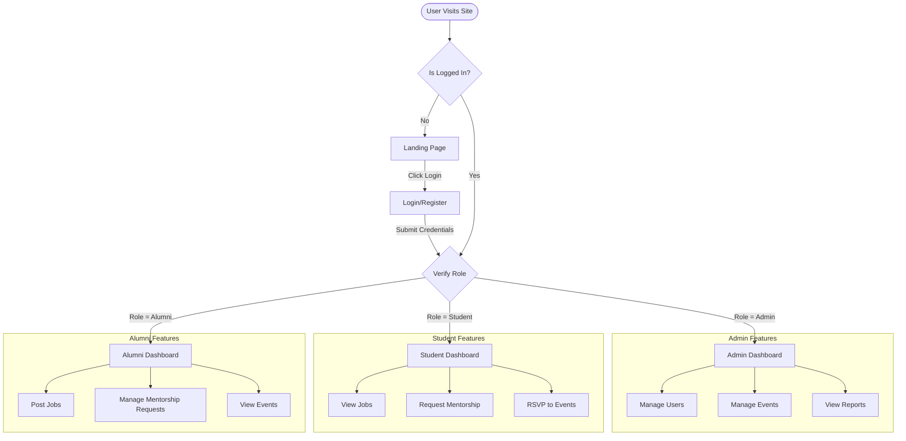

# Project Workflow & Architecture

This document outlines the logical flow of the **College Info Hub** application, breaking down how the modules connect and the order in which they function.

## 🏗️ High-Level Architecture

The application is built around **Role-Based Access Control (RBAC)**. The experience is completely different depending on who you are:
1.  **Admin**: The Controller (Manages data, users, and content).
2.  **Student**: The Consumer (Views content, applies for jobs, requests mentorship).
3.  **Alumni**: The Contributor (Provides mentorship, posts jobs).

---

## 🔄 operational Workflow (Logic Flow)

To understand how the system works, it helps to follow the flow of data:

### Phase 1: The Admin Layer (Foundation)
Everything starts here. The Admin ensures the platform has content and safe users.
1.  **User Verification**: A user registers. They effectively start in a "Pending" state (conceptually). The Admin approves them via the **User Directory**.
2.  **Content Creation**:
    *   **Events**: The Admin creates an Event (e.g., "Tech Talk") and sets the **Audience** (Student/Alumni/All).
    *   **Jobs**: The Admin approves jobs posted by Alumni or posts them directly.
    *   **Reports**: If someone flags a post, the Admin reviews it in the **Reports** module.

### Phase 2: The User Entry (Authentication)
1.  **Login**: The user enters credentials.
2.  **Routing**: The `ProtectedRoute` component checks their role.
    *   If `role === 'admin'` -> Redirect to `/admin/dashboard`.
    *   If `role === 'student'` -> Redirect to `/student/dashboard`.
    *   If `role === 'alumni'` -> Redirect to `/alumni/dashboard`.

### Phase 3: Dashboard & Consumption
Once logged in, the user lands on their personalized **Dashboard**.
1.  **Student Dashboard**: Sees upcoming events (targeted to them), active mentorship sessions, and recent job postings.
2.  **Alumni Dashboard**: Sees mentorship requests from students and their contribution stats.

---

## 🧩 Module Breakdown

### 1. Authentication Module
*   **Purpose**: Security and Role management.
*   **Key Files**: `authSlice.js`, `ProtectedRoute.jsx`.
*   **Flow**: User -> Login -> JWT Token (Mock) -> Redux Store -> UI Access.

### 2. Admin Module (The Control Center)
*   **Dashboard**: Stats overview (Total Users, Reports, Active Jobs).
*   **User Directory**:
    *   Consolidated view of **Students** and **Alumni**.
    *   Actions: **Block**, **Unblock**, **Verify**.
*   **Events Management**:
    *   Create/Edit/Delete events.
    *   **Feature**: Audience Targeting (decides *who* sees the event).
*   **Reports**: Review flagged content.

### 3. Events Module
*   **Flow**: Admin Creates -> Backend Stores (`db_events`) -> User Views.
*   **Features**:
    *   **Filtering**: Students don't see "Alumni Only" events.
    *   **RSVP**: Users click "Join". The Mock API updates the attendee count instantly.

### 4. Mentorship Module
*   **Flow**:
    1.  **Alumni** updates profile with "Areas of Expertise".
    2.  **Student** browses "Find a Mentor".
    3.  **Student** sends a Request.
    4.  **Alumni** accepts/rejects in their Dashboard.

### 5. Jobs Module
*   **Flow**:
    1.  **Alumni/Admin** posts a Job.
    2.  **Job** appears on the Job Board.
    3.  **Student** filters by "Internship" or "Full-time" and Applies.

### 6. Feed Module (Community)
*   **Purpose**: General interaction.
*   **Flow**: User posts update -> Appears in global feed -> Others Like/Comment.

---

## 🛠️ Backend Structure (Mock)

Since this project uses a simulated backend, the data flow is handled by **Interceptors**:

1.  **Frontend Request**: Component calls `API.get('/events')`.
2.  **Mock Adapter (`src/services/mock/index.js`)**: Intercepts the call.
3.  **Handler (`src/services/mock/events.js`)**:
    *   Reads `localStorage` (key: `db_events`).
    *   Returns the JSON data.
4.  **Frontend Response**: Component receives data as if it came from a real server.

This ensures that even though there's no real server, **data persists** across page reloads (because it lives in your browser's LocalStorage).

## 📊 System Architecture Diagram

```mermaid
graph TD
    User[User] -->|Interacts| UI[Frontend UI (React)]
    UI -->|Dispatches Actions| Redux[Redux Store]
    UI -->|API Requests| Axios[Axios Interceptor]
    
    subgraph Mock Backend Layer
        Axios -->|Intercepts| MockAdapter[Mock Adapter]
        MockAdapter -->|Routes to| Handlers{Request Handlers}
        Handlers -->|Auth| AuthHandler[Auth Handler]
        Handlers -->|Events| EventHandler[Events Handler]
        Handlers -->|Jobs| JobHandler[Jobs Handler]
        
        AuthHandler <-->|Read/Write| LS[(LocalStorage)]
        EventHandler <-->|Read/Write| LS
        JobHandler <-->|Read/Write| LS
    end
```

## 🔀 User Journey Flowchart


